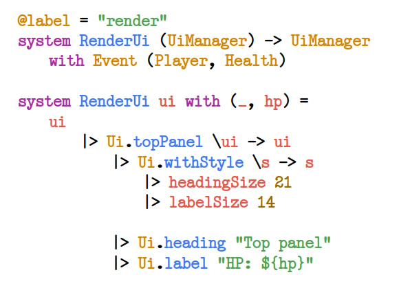

**Xast** (pronounced _"khast"_) is the immutable purely functional ECS-driven programming language designed for games and more.

This project consists of 3 parts:

* `xastc` is a Xast compiler, which is both library and executable, used to compile Xast Source Type files (`.xst`) to Xast Bytecode (`.xbc`);

* `xastvm` is a bytecode virtual machine library, bundled with internal ECS world, used in games, engines and runtimes;

* `xast-server` is a Xast language server built with the LSP protocol on top of `xastc`.